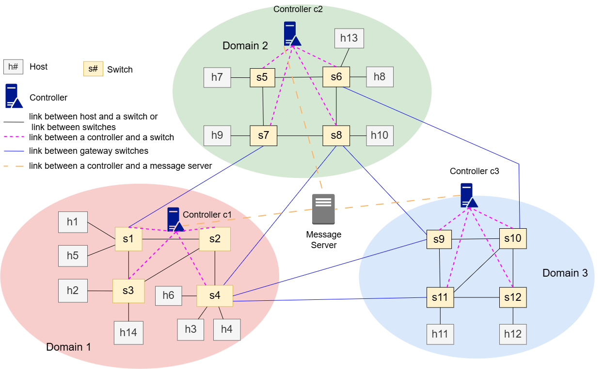
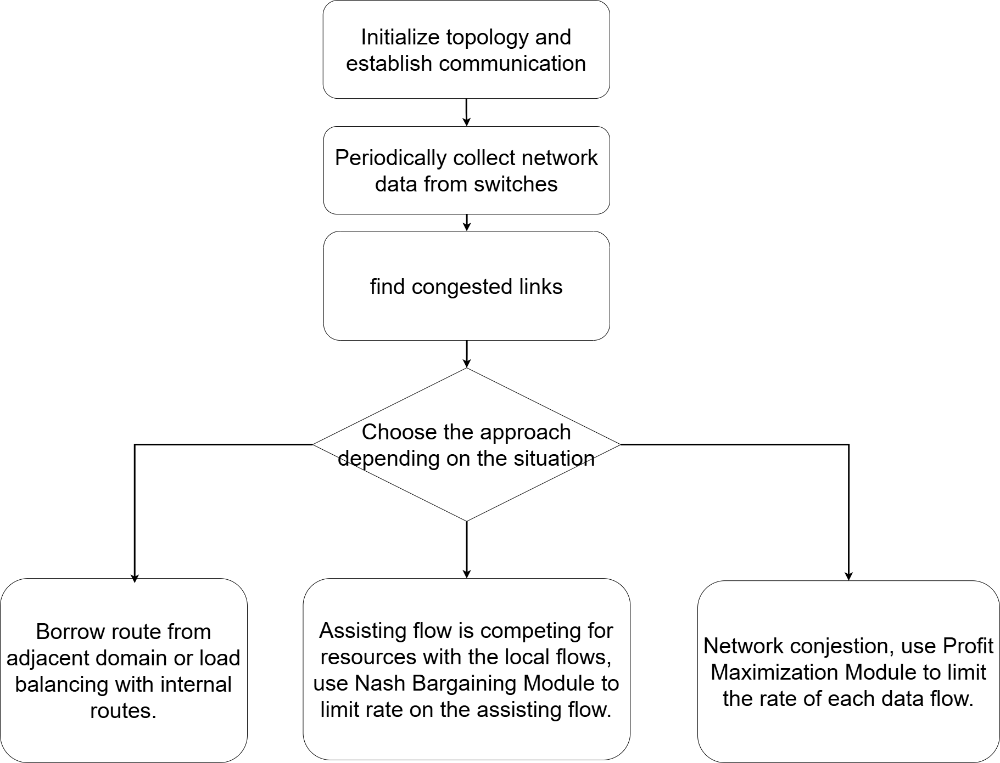

# PNCFM - A SDN Project

## Project Overview
Welcome to "PNCFM Repository".
This is the codebase for my graduate thesis "Cooperative Route Management for Profit-Oriented Flows in Multi-domain SDN Networks." 
My thesis proposed a profit-oriented cross-domain cooperative method that leverages the programmability of SDN to dynamically adjust bandwidth allocation and routing decisions based on the profit associated with each flow. 


## ## Important Links and Tools

1. [Stochastic Switching](https://github.com/saeenali/openvswitch/wiki/Stochastic-Switching-using-Open-vSwitch-in-Mininet): In some cases, the switches would seperate the data flow and transmit the packet out of 2 output port to decrease load on some links, this github project is what I reference to achieve such effect.
2. [Ryu controller](https://github.com/faucetsdn/ryu): Some popular open source controller include OpenDayLight, Ryu, ONOS, etc. This project picks ryu for its high performance, low latency, programmability in python, and lower learning curve.
3. [Mininet](https://mininet.org/): Mininet is a network simulation tool in which the hosts, links, and switches are customizable. In list project, it plays a critical row for running the simulations and showing switch programmabilities.
4. [iPerf](https://iperf.fr/): iPerf is used to initiate data flows and collect trasmission data.

## Quick Setup
This project consists of Mininet, Open vSwitch, Ryu controller, and a message server.

Refernce docs/setup.md for more information.
## Run simulations
This project consists of Mininet, Open vSwitch, Ryu controller, and a message server.

Refernce docs/run_simulation.md for more information.

## Project Objectives and Background Information
This project involves several conponents, including controllers, switches, and user devices/hosts.

1. Controllers: make rules and overseing the designated network area. In this thesis, it is in charge of network data collection, cross-domain cooperation, flow rate metering, flow spliting, and load balancing. Specific load balancing algorithms please reference 
2. Switches: transfer packets and provide the controllers with realtime network data( bytes send, latency, packet loss, etc.).
3. Hosts: User devices that send packets back and forth between each other. At the end of each simulation, iperf report from the flow receiver side is analyzed.

In large companies, or schools, they often have to manage their own networks. Furthermore, some traffic is more important than the others.
Therefore, in this research, we assume each network traffic has a economic value( aka "Profit") to the network owner(school or company).
In this reseach, we develop a method to obtain more "Profit" than the previous researches. To achieve such effect, the following functionality is essential: cross-controller communication, switch flow data extraction and organization, metering, load balancing, and cross-domain cooperation.

### Terminology
A data flow: A series of data packets transmitted from a source to a destionation.
Different Types of data flow: 
- Local flow: the source and destination hosts are in the same domain.
- Cross domain flow: the source and destination hosts are in the different domains.
- Assisting flow: it is originally a local flow, but is redirected due to load balancing algorithms. It goes out from original domain to the assisting domain, and comes back to the original domain via a different gateway switch to finish packet transportation. 


## why this research is important
## background knowledge explained
## 3 methods
## simulation datasets
## System Design

### Topology 

### System flow chart



## Repository structure

This section explains the organization of directories and files in the project following industry-standard software engineering practices.

### Directory Purpose Summary

| Directory | Purpose |
|-----------|---------|
| **`src/`** | Core algorithms, controllers, and network logic that form the project |
| **`scripts/`** | Executable scripts for simulation, analysis, and system management |
| **`tests/`** | Unit tests, integration tests, and experimental simulation variants |
| **`dependencies/`** | External source code (Modified OVS) with custom changes |
| **`outputs/`** | Generated simulation results, logs, and CSV files |
| **`docs/`** | User-facing documentation and guides |
| **`resources/`** | Static assets like diagrams, images, and notification sound |

### Key Files

- **`src/algorithms/pncfm.py`**: Main algorithm implementation PNCFM (Profit negotiation collaborative flow management)
- **`src/config/setting.py`**: Core environment parameters (DISCOVERY_PERIOD, MONITOR_PERIOD, PLR threshold, SLICE, MAX_CAPACITY)
- **`src/config/flow_info.py`**: Test case definitions and flow configurations
- **`scripts/run_mininet_simulation.py`**: Primary entry point for running simulations
- **`scripts\ryu_controller_shortest_forwarding.py`**: Main network controller script that should be run for the simulation.
- **`docs/run_simulation.md`**: Complete guide for setting up and running simulations
- **`dependencies/ovs/`**: Custom-modified Open vSwitch source code with thesis-specific features

### Detailed File Tree
```
PNCFM/
├── README.md                      # Project overview and getting started guide
├── .gitignore                     # Git ignore rules for build artifacts and generated files
├── requirements.txt               # Python dependencies (Ryu, etc.)
│
├── dependencies/                  # External dependencies and modified source code
│   └── OVS281_modified/          # Custom-modified Open vSwitch 2.8.1 source code
│       ├── README.md             # Explains modifications made to OVS
│       ├── CHANGES.md            # Detailed list of custom changes
│       └── [OVS source files]
├── scripts/                      # Utility and analysis scripts
│   ├── run_mininet_simulation.py         # Main simulation runner
│   ├── ryu_controller_shortest_forwarding.py  # Ryu controller 
│   ├── output_test_organize_data.py      # Organize and parse simulation results
│   ├── out_all_bw_convert.py            # Convert iPerf output to CSV
│   ├── script_ovs_install.sh            # Install Open vSwitch
│   ├── script_ovs_start.sh              # Start OVS services
│   ├── script_ovs_restart.sh            # Restart OVS services
│   └── script_ovs_notes.sh              # OVS configuration notes and related commands
│
├── src/                          # Core source code (algorithms, network logic, configuration)
│   ├── __init__.py
│   ├── pncfm.py                 # Main PNCFM (Profit-oriented Network Cooperation) algorithm
│   ├── bw_alloc.py              # Bandwidth allocation logic for CFM and MCRM algorithms.
│   ├── network_awareness.py     # For ryu controller: Network topology discovery and awareness
│   ├── network_Communication.py # For ryu controller: Inter-domain controller communication
│   ├── network_delay_detector.py # For ryu controller: Link delay detection
│   ├── network_monitor.py       # For ryu controller: Network monitoring and metrics collection
│   ├── flow_info.py             # For the whole project: Flow configuration and test case definitions
│   ├── setting.py               # For ryu controller: Environment parameters (DISCOVERY_PERIOD, MONITOR_PERIOD, PLR, SLICE, MAX_CAPACITY)
│   └── real_bw.py               # For simulation realtime monitoring: Real-time bandwidth tracking
│
├── tests/                        # Test cases and experimental simulations
│   ├── __init__.py
│   ├── paper_topo_test.py       # Test if mininet works.
│   ├── SimpleSwitch13.py         # Simple OpenFlow 1.3 switch implementation
│   ├── test_broker.py           # Message broker for inter-controller communication
│   ├── test_client.py           # Test client for broker communication
│   ├── test_pub.py              # Publisher for testing message passing
│   └── simulation/              # Experimental and variant simulations
│       ├── simu.py              # test algorithms variant1
│       ├── simu2.py             # test algorithms variant2
│       ├── simu3.py             # test algorithms variant3
│       └── simu_nbs.py          # PNCFM related test algorithms.
│
├── outputs/                      # Generated results and logs
│   ├── output_flow_info.csv     # Flow information summary. Get this by running flow_info.py directly.
│   └── log/                     # Simulation logs and results
│       ├── real_bw_log_stage*.csv  # Test 1 stage-specific bandwidth logs
│       ├── real_bw_log_t2_case*.csv # Test 2 case-specific bandwidth logs
│       ├── all_method_comparison/   # Comparative analysis aggregating results from all algorithm implementations(Baseline, CFM, MCRM, PNCFM)
│       ├── Baseline/            # Baseline algorithm results
│       ├── CFM/                 # CFM algorithm results
│       ├── MCRM/                # MCRM algorithm results
│       └── PNCFM/               # PNCFM algorithm results
│
├── docs/                         # Documentation
│   ├── README.md               # Documentation index
│   ├── run_simulation.md        # Step-by-step guide to run simulations
│   ├── reorganization.md        # File reorganization plan and structure
│   ├── interview_related_questions_en.md  # Interview Q&A (English)
│   ├── interview_related_questions.md     # Interview Q&A (Chinese)
│   ├── other_notes.md          # Additional notes and observations
│   └── todo.md                 # Project TODO list
│
└── resources/                    # Supporting resources, including diagrams, a ringtone, etc.
    └── diagrams.drawio         # Network topology and system architecture diagrams
```


## 🛡️ License

This project is licensed under the **GPLv3 License**. You are free to use, modify, and share this project with proper attribution, but you can't use it for commercialization.
Any derivative work, even if modified, must also be licensed under GPLv3. 